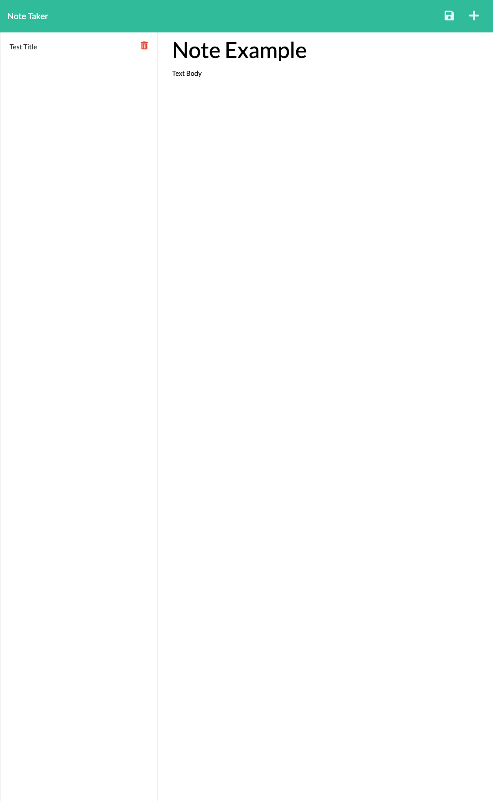

# <h1 align="center"> Note_Taker <h1>

## Description

This application uses Express.js to allow users to take notes via a web interface offering persistent storage.

## Table of Contents

- [Deployed_Link](#Deployed_Link)
- [Installation](#Installation)
- [Usage](#Usage)
- [Screen_Shot](#Screen_Shot)
- [Credits](#Credits)
- [License](#License)
- [Questions](#Questions)

## Deployed_Link

https://note-taker-deploy-ijf.herokuapp.com/

## Installation

The application is deployed to Heroku, so no installation is required.

## Usage

The application has an intuitive interface that allows users to simply save their notes with the file logo in the top right corner, or delete using the trash icon. Both title and text body are required to save the note.

## Screen_Shot

## Credits

Ian Ferris https://github.com/ianjustinferris

## License

https://opensource.org/licenses/MIT

## Questions

ianjustinferris@gmail.com
